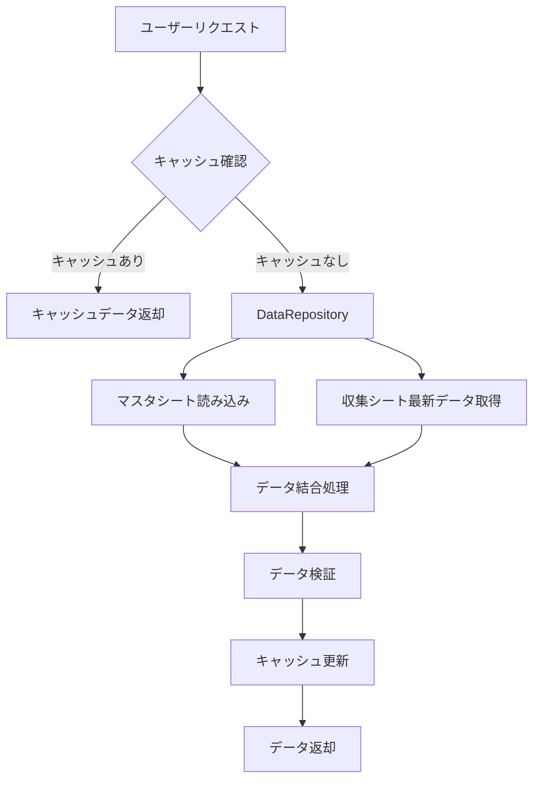

# スプレッドシートビューアー設計書（ハイブリッド方式）

## 1. 概要

### 1.1 目的
本設計書は、マスタシートと収集シートを組み合わせたハイブリッド方式による、高機能なスプレッドシートビューアーの実装仕様を定義します。

### 1.2 基本方針
- **ハイブリッドデータ取得**: マスタシート（基本情報）+ 収集シート（最新状態）
- **高いパフォーマンス**: キャッシュ、遅延読み込み、ページネーション
- **優れたUX**: ダッシュボード、高度なフィルタリング、一括操作
- **運用支援**: 自動レポート、監査証跡、通知機能

## 2. アーキテクチャ設計

### 2.1 データアーキテクチャ

```
┌─────────────────────────────────────────────────────────┐
│                   フロントエンド層                       │
│  ├─ ダッシュボード                                      │
│  ├─ データビューアー                                    │
│  ├─ フィルタリング UI                                  │
│  └─ レポート生成                                        │
└─────────────────────────────────────────────────────────┘
                           ↓
┌─────────────────────────────────────────────────────────┐
│                データアクセス層（GAS）                   │
│  ├─ DataRepository (抽象化層)                           │
│  ├─ CacheManager (キャッシュ管理)                      │
│  ├─ QueryBuilder (クエリ構築)                          │
│  └─ DataValidator (整合性チェック)                     │
└─────────────────────────────────────────────────────────┘
                           ↓
┌─────────────────────────────────────────────────────────┐
│                    データソース層                        │
│  ├─ マスタシート（基本情報）                           │
│  ├─ 収集シート（動的情報）                             │
│  ├─ ビューシート（結合済みデータ）                     │
│  └─ インデックスシート（高速検索用）                   │
└─────────────────────────────────────────────────────────┘
```

### 2.2 データフロー



## 3. データモデル

### 3.1 統合データモデル

```typescript
interface IntegratedDeviceData {
  // マスタシートからの基本情報
  basicInfo: {
    locationNumber: string;      // 拠点管理番号
    category: string;           // カテゴリ
    modelName: string;          // 機種名
    serialNumber: string;       // 製造番号
    assetNumber?: string;       // 資産管理番号
    software?: string;          // ソフトウェア
    os?: string;               // OS
    formUrl?: string;          // フォームURL
    qrCodeUrl?: string;        // QRコードURL
  };
  
  // 収集シートからの最新状態
  currentStatus: {
    timestamp: Date;            // 最終更新日時
    status: string;            // 0-4.ステータス
    manager: string;           // 0-1.担当者
    loanInfo?: {               // 貸出情報
      customer: string;        // 1-1.顧客名または貸出先
      customerNumber: string;  // 1-2.顧客番号
      address: string;         // 1-3.住所
      hasUserDevice: boolean;  // 1-4.ユーザー機の預り有無
      userDeviceSerial?: string; // 1-7.預りユーザー機のシリアルNo
      receiptNumber?: string;  // 1-8.お預かり証No
    };
    internalStatus?: string;   // 3-0.社内ステータス
    location?: string;         // 現在の所在
    remarks?: string;          // 備考
  };
  
  // 計算フィールド
  computed: {
    daysSinceLastUpdate: number;
    isOverdue: boolean;         // 長期貸出判定
    needsAttention: boolean;    // 要注意フラグ
    statusHistory?: StatusHistory[];
  };
}
```

### 3.2 ビューシート構造

統合ビューはQUERY関数を使用せず、フォーム送信時のトリガーで動的に更新されます。

```javascript
// 統合ビュー更新処理
function updateIntegratedView() {
  const masterData = getMasterSheetData();
  const statusData = getLatestStatusCollectionData();
  const integratedData = integrateDeviceData(masterData, statusData);
  updateIntegratedViewSheet(integratedData);
}
```

## 4. 機能詳細設計

### 4.1 データアクセス層

#### 4.1.1 DataRepository

```javascript
// data-repository.gs
class DataRepository {
  constructor() {
    this.cache = new CacheManager();
    this.validator = new DataValidator();
  }
  
  /**
   * 統合データ取得
   * @param {Object} options - 検索オプション
   * @returns {IntegratedDeviceData[]}
   */
  getIntegratedData(options = {}) {
    const cacheKey = this.generateCacheKey(options);
    const cached = this.cache.get(cacheKey);
    
    if (cached && !options.forceRefresh) {
      return cached;
    }
    
    // マスタデータ取得
    const masterData = this.getMasterData(options);
    
    // 収集シート最新データ取得
    const collectionData = this.getLatestCollectionData(
      masterData.map(item => item.locationNumber)
    );
    
    // データ結合
    const integratedData = this.mergeData(masterData, collectionData);
    
    // バリデーション
    const validatedData = this.validator.validate(integratedData);
    
    // キャッシュ更新
    this.cache.set(cacheKey, validatedData, options.cacheDuration);
    
    return validatedData;
  }
  
  /**
   * 最新収集データ取得（バッチ処理対応）
   */
  private getLatestCollectionData(locationNumbers) {
    const batchSize = 50;
    const results = [];
    
    for (let i = 0; i < locationNumbers.length; i += batchSize) {
      const batch = locationNumbers.slice(i, i + batchSize);
      const query = `
        SELECT * WHERE C IN ('${batch.join("','")}')
        ORDER BY C, A DESC
      `;
      
      const data = this.executeQuery('端末ステータス収集', query);
      results.push(...this.extractLatestRecords(data));
    }
    
    return results;
  }
}
```

#### 4.1.2 CacheManager

```javascript
// cache-manager.gs
class CacheManager {
  constructor() {
    this.scriptCache = CacheService.getScriptCache();
    this.documentCache = CacheService.getDocumentCache();
  }
  
  get(key) {
    // 短期キャッシュ確認
    let data = this.scriptCache.get(key);
    if (data) return JSON.parse(data);
    
    // 長期キャッシュ確認
    data = this.documentCache.get(key);
    if (data) return JSON.parse(data);
    
    return null;
  }
  
  set(key, data, duration = 600) {
    const serialized = JSON.stringify(data);
    
    if (duration <= 600) {
      this.scriptCache.put(key, serialized, duration);
    } else {
      this.documentCache.put(key, serialized, Math.min(duration, 21600));
    }
  }
  
  invalidate(pattern) {
    // パターンマッチでキャッシュ無効化
    if (pattern === '*') {
      this.scriptCache.removeAll();
      this.documentCache.removeAll();
    }
  }
}
```

### 4.2 UI/UX機能

#### 4.2.1 ダッシュボード

```javascript
// dashboard-functions.js
class DashboardManager {
  constructor() {
    this.charts = {};
  }
  
  /**
   * ダッシュボードデータ生成
   */
  generateDashboardData() {
    const data = DataRepository.getIntegratedData();
    
    return {
      summary: {
        total: data.length,
        lending: data.filter(d => d.currentStatus.status === '1.貸出中').length,
        available: data.filter(d => d.currentStatus.status === '3.社内にて保管中').length,
        maintenance: data.filter(d => d.currentStatus.internalStatus === '1.修理中').length,
        overdue: data.filter(d => d.computed.isOverdue).length
      },
      
      charts: {
        statusDistribution: this.generateStatusChart(data),
        locationDistribution: this.generateLocationChart(data),
        trendData: this.generateTrendChart(data),
        alertsData: this.generateAlertsData(data)
      },
      
      recentActivities: this.getRecentActivities(data, 10),
      upcomingDeadlines: this.getUpcomingDeadlines(data, 7)
    };
  }
  
  /**
   * ステータス分布チャート
   */
  generateStatusChart(data) {
    const statusCount = {};
    data.forEach(item => {
      const status = item.currentStatus.status;
      statusCount[status] = (statusCount[status] || 0) + 1;
    });
    
    return {
      type: 'pie',
      data: Object.entries(statusCount).map(([status, count]) => ({
        label: status,
        value: count,
        color: this.getStatusColor(status)
      }))
    };
  }
}
```

#### 4.2.2 高度なフィルタリング

```javascript
// advanced-filter.js
class AdvancedFilter {
  constructor() {
    this.filters = [];
    this.savedFilters = this.loadSavedFilters();
  }
  
  /**
   * フィルタ条件追加
   */
  addFilter(field, operator, value, groupId = 'default') {
    this.filters.push({
      id: Utilities.getUuid(),
      groupId,
      field,
      operator,
      value,
      active: true
    });
  }
  
  /**
   * 複合フィルタ適用
   */
  applyFilters(data) {
    return data.filter(item => {
      const groups = this.groupFiltersByGroupId();
      
      // グループ内はOR、グループ間はAND
      return Object.values(groups).every(group => 
        group.some(filter => this.evaluateFilter(item, filter))
      );
    });
  }
  
  /**
   * カスタムフィルタ保存
   */
  saveCustomFilter(name, description) {
    const filterConfig = {
      id: Utilities.getUuid(),
      name,
      description,
      filters: this.filters,
      created: new Date(),
      lastUsed: new Date()
    };
    
    this.savedFilters.push(filterConfig);
    PropertiesService.getUserProperties().setProperty(
      'savedFilters',
      JSON.stringify(this.savedFilters)
    );
  }
  
  /**
   * クイックフィルタ
   */
  static getQuickFilters() {
    return [
      {
        id: 'lending',
        name: '貸出中のみ',
        icon: 'fas fa-share',
        filter: item => item.currentStatus.status === '1.貸出中'
      },
      {
        id: 'overdue',
        name: '長期貸出（3ヶ月以上）',
        icon: 'fas fa-exclamation-triangle',
        filter: item => item.computed.isOverdue
      },
      {
        id: 'maintenance',
        name: '修理中',
        icon: 'fas fa-tools',
        filter: item => item.currentStatus.internalStatus === '1.修理中'
      },
      {
        id: 'available',
        name: '貸出可能',
        icon: 'fas fa-check-circle',
        filter: item => item.currentStatus.internalStatus === '5.貸出可能'
      }
    ];
  }
}
```

### 4.3 パフォーマンス最適化

#### 4.3.1 遅延読み込み

```javascript
// lazy-loader.js
class LazyLoader {
  constructor(pageSize = 50) {
    this.pageSize = pageSize;
    this.loadedPages = new Map();
    this.totalItems = 0;
  }
  
  /**
   * ページデータ取得
   */
  async loadPage(pageNumber) {
    if (this.loadedPages.has(pageNumber)) {
      return this.loadedPages.get(pageNumber);
    }
    
    const offset = (pageNumber - 1) * this.pageSize;
    const data = await this.fetchPageData(offset, this.pageSize);
    
    this.loadedPages.set(pageNumber, data);
    return data;
  }
  
  /**
   * 仮想スクロール対応
   */
  async getVisibleItems(scrollTop, viewportHeight, itemHeight) {
    const startIndex = Math.floor(scrollTop / itemHeight);
    const endIndex = Math.ceil((scrollTop + viewportHeight) / itemHeight);
    
    const startPage = Math.floor(startIndex / this.pageSize) + 1;
    const endPage = Math.floor(endIndex / this.pageSize) + 1;
    
    const items = [];
    for (let page = startPage; page <= endPage; page++) {
      const pageData = await this.loadPage(page);
      items.push(...pageData);
    }
    
    return items.slice(
      startIndex % this.pageSize,
      endIndex - (startPage - 1) * this.pageSize
    );
  }
}
```

#### 4.3.2 プリフェッチ戦略

```javascript
// prefetch-manager.gs
class PrefetchManager {
  constructor() {
    this.prefetchQueue = [];
    this.prefetching = false;
  }
  
  /**
   * よく使われる拠点のデータを事前読み込み
   */
  prefetchFrequentLocations() {
    const usageStats = this.getUsageStatistics();
    const topLocations = usageStats
      .sort((a, b) => b.accessCount - a.accessCount)
      .slice(0, 5)
      .map(stat => stat.locationId);
    
    topLocations.forEach(locationId => {
      this.addToPrefetchQueue({
        type: 'location',
        id: locationId,
        priority: 'high'
      });
    });
    
    this.processPrefetchQueue();
  }
  
  /**
   * 関連データの先読み
   */
  prefetchRelatedData(currentItem) {
    // 同じカテゴリの機器
    this.addToPrefetchQueue({
      type: 'category',
      value: currentItem.category,
      priority: 'medium'
    });
    
    // 同じ拠点の機器
    this.addToPrefetchQueue({
      type: 'location',
      value: currentItem.location,
      priority: 'medium'
    });
  }
}
```

### 4.4 運用支援機能

#### 4.4.1 自動レポート生成

```javascript
// report-generator.gs
class ReportGenerator {
  /**
   * 月次レポート生成
   */
  generateMonthlyReport() {
    const reportData = {
      period: {
        year: new Date().getFullYear(),
        month: new Date().getMonth() + 1
      },
      
      summary: this.generateMonthlySummary(),
      
      sections: [
        this.generateUtilizationSection(),
        this.generateMaintenanceSection(),
        this.generateCostSection(),
        this.generateAnomalySection()
      ],
      
      recommendations: this.generateRecommendations()
    };
    
    return this.formatReport(reportData);
  }
  
  /**
   * 利用状況セクション
   */
  generateUtilizationSection() {
    const data = DataRepository.getIntegratedData();
    
    return {
      title: '機器利用状況',
      metrics: {
        utilizationRate: this.calculateUtilizationRate(data),
        averageLoanDuration: this.calculateAverageLoanDuration(data),
        topBorrowers: this.getTopBorrowers(data, 10),
        underutilizedDevices: this.findUnderutilizedDevices(data)
      },
      charts: {
        dailyUtilization: this.generateDailyUtilizationChart(data),
        categoryBreakdown: this.generateCategoryBreakdownChart(data)
      }
    };
  }
  
  /**
   * 自動アラート生成
   */
  generateAlerts(data) {
    const alerts = [];
    
    // 長期貸出アラート
    data.filter(item => item.computed.daysSinceLastUpdate > 90)
      .forEach(item => {
        alerts.push({
          type: 'warning',
          category: 'long-term-loan',
          message: `${item.basicInfo.locationNumber}が90日以上貸出中です`,
          item: item,
          suggestedAction: '返却確認または契約更新'
        });
      });
    
    // メンテナンス期限アラート
    data.filter(item => this.isMaintenanceDue(item))
      .forEach(item => {
        alerts.push({
          type: 'info',
          category: 'maintenance',
          message: `${item.basicInfo.locationNumber}のメンテナンスが必要です`,
          item: item,
          suggestedAction: 'メンテナンススケジュール確認'
        });
      });
    
    return alerts;
  }
}
```

#### 4.4.2 監査証跡

```javascript
// audit-trail.gs
class AuditTrail {
  constructor() {
    this.auditSheet = 'audit_log';
  }
  
  /**
   * 変更記録
   */
  logChange(action, target, changes, user, reason) {
    const auditEntry = {
      id: Utilities.getUuid(),
      timestamp: new Date(),
      action: action,
      target: {
        type: target.type,
        id: target.id,
        name: target.name
      },
      changes: changes,
      user: {
        email: user.email,
        name: user.name,
        ip: this.getUserIP()
      },
      reason: reason,
      metadata: {
        userAgent: this.getUserAgent(),
        sessionId: Session.getTemporaryActiveUserKey()
      }
    };
    
    this.saveAuditEntry(auditEntry);
    
    // 重要な変更は通知
    if (this.isSignificantChange(action, changes)) {
      this.notifyAdministrators(auditEntry);
    }
  }
  
  /**
   * 監査レポート生成
   */
  generateAuditReport(startDate, endDate) {
    const entries = this.getAuditEntries(startDate, endDate);
    
    return {
      period: { start: startDate, end: endDate },
      summary: {
        totalChanges: entries.length,
        uniqueUsers: new Set(entries.map(e => e.user.email)).size,
        changesByType: this.groupByAction(entries),
        significantChanges: entries.filter(e => e.significant)
      },
      details: entries,
      compliance: this.checkCompliance(entries)
    };
  }
}
```

#### 4.4.3 通知機能拡張

```javascript
// notification-manager.gs
class NotificationManager {
  constructor() {
    this.channels = {
      email: new EmailChannel(),
      slack: new SlackChannel(),
      teams: new TeamsChannel()
    };
  }
  
  /**
   * 統合通知送信
   */
  async notify(notification) {
    const enabledChannels = this.getEnabledChannels(notification.recipient);
    
    const results = await Promise.allSettled(
      enabledChannels.map(channel => 
        this.channels[channel].send(notification)
      )
    );
    
    this.logNotificationResults(notification, results);
  }
  
  /**
   * 通知テンプレート
   */
  static getTemplates() {
    return {
      statusChange: {
        subject: '機器ステータス変更通知',
        template: `
          機器 {{locationNumber}} のステータスが変更されました。
          
          変更前: {{oldStatus}}
          変更後: {{newStatus}}
          変更者: {{changedBy}}
          変更日時: {{timestamp}}
          
          詳細: {{detailsUrl}}
        `
      },
      
      overdueReminder: {
        subject: '長期貸出リマインダー',
        template: `
          以下の機器が{{days}}日間貸出中です：
          
          機器番号: {{locationNumber}}
          貸出先: {{customer}}
          貸出開始日: {{loanDate}}
          
          返却確認または契約更新をお願いします。
        `
      },
      
      maintenanceAlert: {
        subject: 'メンテナンス期限通知',
        template: `
          以下の機器のメンテナンス期限が近づいています：
          
          {{#devices}}
          - {{locationNumber}} (期限: {{dueDate}})
          {{/devices}}
          
          メンテナンススケジュールをご確認ください。
        `
      }
    };
  }
}

// Slack通知チャネル
class SlackChannel {
  constructor() {
    this.webhookUrl = PropertiesService.getScriptProperties()
      .getProperty('SLACK_WEBHOOK_URL');
  }
  
  async send(notification) {
    const payload = {
      text: notification.subject,
      blocks: this.buildBlocks(notification),
      channel: notification.channel || '#general'
    };
    
    return UrlFetchApp.fetch(this.webhookUrl, {
      method: 'post',
      contentType: 'application/json',
      payload: JSON.stringify(payload)
    });
  }
}
```

## 5. 実装フェーズ

### フェーズ1: 基盤整備（2週間）
1. **データアクセス層の実装**
   - DataRepository基本実装
   - CacheManager実装
   - 基本的な結合処理

2. **ビューシート作成**
   - マスタ・収集シート結合ビュー
   - インデックスシート

3. **基本UI改修**
   - 既存UIのデータソース切替
   - 基本的なフィルタリング

### フェーズ2: 機能拡張（3週間）
1. **ダッシュボード実装**
   - サマリー表示
   - グラフ/チャート
   - アラート表示

2. **高度なフィルタリング**
   - 複合条件フィルタ
   - カスタムフィルタ保存
   - クイックフィルタ

3. **パフォーマンス最適化**
   - 遅延読み込み
   - ページネーション
   - プリフェッチ

### フェーズ3: 運用最適化（2週間）
1. **レポート機能**
   - 月次レポート自動生成
   - カスタムレポート作成
   - エクスポート機能

2. **監査・通知機能**
   - 監査ログ実装
   - 通知チャネル統合
   - アラート自動化

3. **管理機能**
   - 一括操作
   - データインポート/エクスポート
   - システム設定画面

## 6. 設定管理

### 6.1 システム設定

```javascript
// config.gs に追加
const VIEWER_CONFIG = {
  // データソース設定
  dataSources: {
    enableHybridMode: true,
    viewSheetName: 'integrated_view',
    indexSheetName: 'search_index',
    maxBatchSize: 50
  },
  
  // キャッシュ設定
  cache: {
    defaultDuration: 600,      // 10分
    longTermDuration: 3600,    // 1時間
    maxCacheSize: 100         // MB
  },
  
  // UI設定
  ui: {
    defaultPageSize: 50,
    enableVirtualScroll: true,
    enableDashboard: true,
    theme: 'light'
  },
  
  // 通知設定
  notifications: {
    enableEmail: true,
    enableSlack: false,
    enableTeams: false,
    overdueThreshold: 90,      // 日
    maintenanceReminder: 30    // 日前
  },
  
  // レポート設定
  reports: {
    autoGenerate: true,
    schedule: 'monthly',
    recipients: ['admin@example.com'],
    includeCharts: true
  }
};
```

### 6.2 ユーザー設定

```javascript
// ユーザー別設定
const USER_PREFERENCES = {
  // デフォルト設定
  defaults: {
    pageSize: 50,
    defaultView: 'table',
    notifications: ['email'],
    language: 'ja'
  },
  
  // 権限設定
  permissions: {
    admin: ['all'],
    manager: ['view', 'edit', 'export'],
    user: ['view', 'export'],
    guest: ['view']
  }
};
```

## 7. セキュリティ考慮事項

### 7.1 アクセス制御
- ロールベースアクセス制御（RBAC）
- 機密データのマスキング
- 操作ログの完全記録

### 7.2 データ保護
- 個人情報の暗号化
- 通信の暗号化（HTTPS）
- バックアップの暗号化

## 8. 移行計画

### 8.1 データ移行
1. 既存データの整合性チェック
2. ビューシート作成とテスト
3. 段階的な機能切替

### 8.2 ユーザー教育
1. 管理者向けトレーニング
2. エンドユーザー向けマニュアル作成
3. FAQ・トラブルシューティングガイド

## 9. 保守・運用

### 9.1 定期メンテナンス
- 週次: キャッシュクリア、パフォーマンスチェック
- 月次: データ整合性チェック、使用統計分析
- 四半期: セキュリティ監査、アップデート

### 9.2 監視項目
- API使用量
- レスポンスタイム
- エラー率
- ユーザーアクティビティ

## 10. 将来の拡張性

### 10.1 計画中の機能
- AI予測分析（需要予測）
- モバイルアプリ対応
- 外部システム連携（ERP等）
- リアルタイムコラボレーション

### 10.2 技術的改善
- GraphQL APIの導入
- WebSocketによるリアルタイム更新
- Progressive Web App（PWA）化
- 機械学習による異常検知