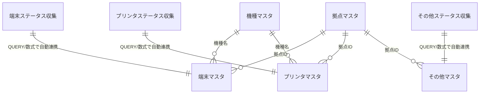
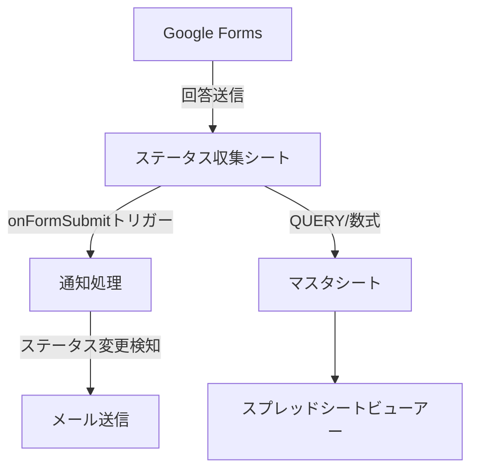

# データ設計書

## 1. データモデル概要

### 1.1 データ構造

```
代替機管理システム データ構造
├── ステータス収集シート（Google Forms送信先）
│   ├── 端末ステータス収集    # 端末フォームの回答を直接受信
│   ├── プリンタステータス収集 # プリンタフォームの回答を直接受信
│   └── その他ステータス収集   # その他フォームの回答を直接受信
│
└── マスタデータ（収集シートから自動取得）
    ├── 拠点マスタ           # 拠点情報
    ├── 機種マスタ           # 機種情報
    ├── データタイプマスタ   # データタイプ情報
    ├── 端末マスタ           # 端末機器情報（数式/QUERYで収集シートから取得）
    ├── プリンタマスタ       # プリンタ機器情報（数式/QUERYで収集シートから取得）
    └── その他マスタ         # その他機器情報（数式/QUERYで収集シートから取得）
```

### 1.2 データ関係



### 1.3 データフローと通知の仕組み

```
[Google Forms] → [ステータス収集シート] → [マスタシート]
      ↓                    ↓                      ↓
   回答送信         onFormSubmitトリガー    数式/QUERYで自動更新
                           ↓
                     通知メール送信
                  （ステータス変更時のみ）
```

**重要なポイント**:
- Google Formsの回答は必ず「ステータス収集シート」に送信される
- マスタシートは収集シートから最新データを自動的に取得（数式/QUERY使用）
- 通知はフォーム送信時（onFormSubmitトリガー）のみ発生
- スプレッドシートビューアーでの編集では通知は発生しない

## 2. ステータス収集シート設計

### 2.1 端末ステータス収集シート

#### 2.1.1 概要
Google Formsから端末に関する回答を直接受信するシート。onFormSubmitトリガーが設定され、回答受信時に通知処理を実行。

#### 2.1.2 シート構造
| 列名                     | データ型 | 説明                                   | 例                           |
| ----------------------- | -------- | ------------------------------------- | ---------------------------- |
| タイムスタンプ           | DateTime | フォーム送信日時（自動記録）            | 2024/07/02 14:30:00         |
| メールアドレス           | Email    | 回答者のメールアドレス                  | user@example.com            |
| 0-1.担当者              | String   | 担当者名                              | 山田太郎                     |
| 0-2.拠点管理番号         | String   | 機器固有識別子                         | OSA_SV_ThinkPad_ABC123_001  |
| 0-3.機種名              | String   | 機種名                                | ThinkPad X1 Carbon          |
| 0-4.ステータス          | String   | 現在のステータス                       | 1.貸出中                    |
| 1-1.貸出先              | String   | 貸出先情報（ステータス1の場合）          | ○○商事株式会社              |
| 1-2.貸出日              | Date     | 貸出開始日（ステータス1の場合）          | 2024/07/01                 |
| ... （動的列）           | Various  | フォーム質問に応じて動的に追加          | -                          |

### 2.2 プリンタステータス収集シート

#### 2.2.1 概要
Google Formsからプリンタに関する回答を直接受信するシート。端末と同様にonFormSubmitトリガーが設定。

#### 2.2.2 シート構造
端末ステータス収集シートと同様の構造だが、プリンタ特有の項目を含む。

### 2.3 その他ステータス収集シート

#### 2.3.1 概要
Router、Hub、その他機器に関する回答を受信するシート。

### 2.4 収集シートの特徴

#### 2.4.1 データ蓄積
- すべてのフォーム回答履歴を保持（監査証跡）
- 同一拠点管理番号の複数回答も時系列で保存
- 3年以上経過したデータは自動ローテーション（最新1件は必ず保持）

#### 2.4.2 トリガー設定
```javascript
// onFormSubmitトリガーの設定例
function onFormSubmit(e) {
  // ステータス変更検知
  // 通知メール送信
  // ログ記録
}
```

#### 2.4.3 マスタシートとの連携
- マスタシートは最新データのみを表示
- QUERY関数で拠点管理番号ごとの最新レコードを取得
- 例：`=QUERY('端末ステータス収集'!A:Z, "SELECT * WHERE C = '拠点管理番号' ORDER BY A DESC LIMIT 1")`

## 3. マスタデータ設計

### 3.1 拠点マスタ

#### 3.1.1 テーブル構造

| 列名                   | データ型 | 必須 | 説明                                            | 例                     |
| ---------------------- | -------- | ---- | ----------------------------------------------- | ---------------------- |
| 拠点 ID                | String   | ✓    | 拠点識別子（小文字英数字のみ、20 文字以内）     | osaka                  |
| 拠点コード             | String   | ✓    | 拠点管理番号用コード（大文字英語、20 文字以内） | OSAKA                  |
| 拠点名                 | String   | ✓    | 拠点の正式名称                                  | 大阪営業所             |
| 管轄                   | String   | ✓    | 管轄エリア（関西、関東、九州等）                | 関西                   |
| グループメールアドレス | Email    | ✓    | 課のグループメール                              | test-group@example.com |
| ステータス変更通知     | Boolean  | ✓    | ステータス変更時の通知ON/OFF                     | true                   |
| ステータス             | String   | ✓    | 有効/無効                                       | active                 |
| 作成日                 | DateTime | ✓    | レコード作成日時                                | 2024/07/02 14:30:00    |
| 更新日                 | DateTime | ✓    | 最終更新日時                                    | 2024/07/02 14:30:00    |

#### 3.1.2 制約・ルール

- **拠点 ID**: 小文字英数字のみ、20 文字以内、ユニーク
- **拠点コード**: 大文字英語のみ、20 文字以内、ユニーク
- **管轄**: 管轄エリア名（文字列、自由入力）
- **グループメールアドレス**: メール形式バリデーション
- **ステータス変更通知**: `true` または `false`、デフォルトは `false`
- **ステータス**: `active` または `inactive`
- **日時フィールド**: `yyyy/MM/dd HH:mm:ss` 形式（Google Apps Script による自動生成）

### 2.2 機種マスタ

#### 2.2.1 テーブル構造

| 列名     | データ型 | 必須 | 説明                                         | 例                  |
| -------- | -------- | ---- | -------------------------------------------- | ------------------- |
| 機種 ID  | String   | ✓    | 自動生成 ID                                  | MODEL_001           |
| 機種名   | String   | ✓    | 機種の正式名称（スペース禁止、ハイフン使用） | ThinkPad-X1-Carbon  |
| メーカー | String   | ✓    | 製造メーカー名                               | Lenovo              |
| カテゴリ | String   | ✓    | 機器カテゴリ（事前定義、頭文字大文字）       | Desktop             |
| 作成日   | DateTime | ✓    | レコード作成日時                             | 2024/07/02 14:30:00 |
| 更新日   | DateTime | ✓    | 最終更新日時                                 | 2024/07/02 14:30:00 |
| 備考     | String   |      | 補足情報                                     | 第 10 世代          |

#### 2.2.2 制約・ルール

- **機種 ID**: 自動生成、ユニーク
- **機種名**: スペース禁止、ハイフン（-）使用、アンダースコア（\_）禁止
- **カテゴリ**: 事前定義されたカテゴリのみ有効（Printer, Desktop, Laptop, Server, Tablet, Router, Hub, Other）、頭文字大文字必須

#### 2.2.3 カテゴリマスタ

| カテゴリ（英語） | カテゴリ（日本語） | 説明                       |
| ---------------- | ------------------ | -------------------------- |
| Desktop          | デスクトップ PC    | デスクトップコンピュータ   |
| Laptop           | ノート PC          | ノートパソコン             |
| Server           | サーバー           | サーバー機器               |
| Tablet           | タブレット         | タブレット端末             |
| Printer          | プリンタ           | プリンター機器             |
| Router           | ルーター           | ネットワークルーター       |
| Hub              | ハブ               | ネットワークハブ・スイッチ |
| Other            | その他             | その他機器                 |

### 2.3 データタイプマスタ（表示形式定義）

#### 2.3.1 概要

データタイプマスタは、フロントエンドでのデータ表示形式（ビューモード）を定義するマスタです。実際のデータレコードにはデータタイプ ID は含まれず、表示時にユーザーが選択する表示形式を管理します。

#### 2.3.2 テーブル構造

| 列名             | データ型 | 必須 | 説明                          | 例                                                                                      |
| ---------------- | -------- | ---- | ----------------------------- | --------------------------------------------------------------------------------------- |
| データタイプ ID  | String   | ✓    | データタイプ識別子            | NORMAL                                                                                  |
| データタイプ名   | String   | ✓    | データタイプの表示名          | 通常データ                                                                              |
| 説明             | String   |      | データタイプの詳細説明        | 日常的な機器管理データ表示                                                              |
| 表示順序         | Number   | ✓    | ドロップダウンでの表示順序    | 1                                                                                       |
| フィルタ条件     | String   |      | 表示データのフィルタ条件      | status=active                                                                           |
| データソース設定 | String   |      | データ取得元設定（JSON 形式） | {"sourceSheets":["端末ステータス収集","プリンタステータス収集"],"columnMappings":{...}} |
| 表示列設定       | String   |      | 表示する列の設定（JSON 形式） | {"columns":["拠点管理番号","機器種別","機種名","製造番号","利用状況","更新日時"]}       |
| ステータス       | String   | ✓    | 有効/無効                     | active                                                                                  |
| 作成日           | DateTime | ✓    | レコード作成日時              | 2024/07/02 14:30:00                                                                     |
| 更新日           | DateTime | ✓    | 最終更新日時                  | 2024/07/02 14:30:00                                                                     |

#### 2.3.3 制約・ルール

- **データタイプ ID**: 英語大文字、アンダースコア、ユニーク
- **表示順序**: 正の整数、ユニーク
- **ステータス**: `active` または `inactive`
- **フィルタ条件**: 表示データの絞り込み条件（JSON 形式推奨）
- **データソース設定**: データ取得元シートと列マッピング（JSON 形式）
- **日時フィールド**: `yyyy/MM/dd HH:mm:ss` 形式（Google Apps Script による自動生成）

#### 2.3.4 初期データ

**通常データ（NORMAL）**:

```json
{
  "データタイプID": "NORMAL",
  "データタイプ名": "通常データ",
  "説明": "日常的な機器管理データ表示（ステータス連動型）",
  "表示順序": 1,
  "フィルタ条件": null,
  "データソース設定": {
    "sourceType": "dynamic",
    "description": "端末・プリンタ・その他マスタから動的取得",
    "sourceSheets": ["端末マスタ", "プリンタマスタ", "その他マスタ"],
    "columnMappings": {
      "拠点管理番号": "拠点管理番号",
      "機器種別": "dynamic_device_type",
      "機種名": "機種名",
      "製造番号": "製造番号",
      "タイムスタンプ": "更新日",
      "0-1.担当者": "dynamic_from_forms",
      "0-4.ステータス": "dynamic_from_forms",
      "預かり機のステータス": "預かり機のステータス"
    },
    "dynamicFields": {
      "機器種別": {
        "logic": "categoryToDeviceType",
        "mapping": {
          "Server": "端末",
          "Desktop": "端末",
          "Laptop": "端末",
          "Tablet": "端末",
          "Printer": "プリンタ",
          "Router": "その他",
          "Hub": "その他",
          "Other": "その他"
        }
      },
      "dynamic_from_forms": {
        "description": "Googleフォームから投稿されたデータは動的に列として追加される"
      }
    }
  },
  "表示列設定": {
    "statusDriven": true,
    "statusColumnKey": "0-4.ステータス",
    "prefixBasedFiltering": true,
    "nestedStatusFiltering": true,
    "baseColumns": [
      "拠点管理番号",
      "機器種別",
      "機種名",
      "製造番号",
      "タイムスタンプ",
      "0-1.担当者"
    ],
    "columnFilterRules": {
      "description": "ステータスの接頭辞数字に基づくフィルタリング（動的2段階ネスト対応）",
      "filterLogic": "showOnlyMatchingPrefix",
      "dynamicNestedFiltering": true,
      "nestedStatusRules": {
        "3.社内にて保管中": {
          "nestedStatusColumnKey": "3-0.社内ステータス",
          "description": "社内ステータスによる動的2段階フィルタリング（事前定義なし）",
          "dynamicDetection": {
            "enabled": true,
            "detectionLogic": "extractNestedPrefixesFromAvailableColumns",
            "basePattern": "3-*",
            "nestedPattern": "3-{X}-*",
            "description": "利用可能な列から3-X-*パターンを動的検出し、3-0.社内ステータスの値に応じてフィルタリング"
          }
        }
      },
      "fallbackColumns": [
        "拠点管理番号",
        "機器種別",
        "機種名",
        "製造番号",
        "タイムスタンプ",
        "0-1.担当者",
        "0-4.ステータス",
        "更新日時"
      ]
    }
  },
  "ステータス": "active"
}
```

**監査データ（AUDIT）**:

```json
{
  "データタイプID": "AUDIT",
  "データタイプ名": "監査データ",
  "説明": "監査・検査用データ表示",
  "表示順序": 2,
  "フィルタ条件": null,
  "データソース設定": {
    "sourceType": "specific_sheets",
    "description": "端末ステータス収集・プリンタステータス収集シートから取得",
    "sourceSheets": ["端末ステータス収集", "プリンタステータス収集"],
    "columnMappings": {
      "担当者": "A列",
      "資産管理番号": "B列",
      "拠点管理番号": "C列",
      "機種名": "D列",
      "製造番号": "E列",
      "ソフトウェア": "F列",
      "OS": "G列",
      "ステータス": "H列",
      "貸出先": "I列",
      "貸出日": "J列",
      "ユーザー預り機有": "K列",
      "お預かり証No.": "L列",
      "備考": "M列"
    },
    "alternativeMapping": {
      "enabled": true,
      "description": "列位置ではなくヘッダー名での取得も可能",
      "headerBasedMapping": {
        "担当者": ["担当者", "責任者", "管理者"],
        "資産管理番号": ["資産管理番号", "資産番号", "アセット番号"],
        "拠点管理番号": ["拠点管理番号", "管理番号", "識別番号"],
        "機種名": ["機種名", "モデル名", "製品名"],
        "製造番号": ["製造番号", "シリアル番号", "S/N"],
        "ソフトウェア": ["ソフトウェア", "SW", "インストールソフト"],
        "OS": ["OS", "オペレーティングシステム"],
        "ステータス": ["ステータス", "状況", "状態"],
        "貸出先": ["貸出先", "利用者", "ユーザー"],
        "貸出日": ["貸出日", "開始日", "利用開始日"],
        "ユーザー預り機有": ["ユーザー預り機有", "預り機", "代替機"],
        "お預かり証No.": ["お預かり証No.", "預かり証番号", "証明書番号"],
        "備考": ["備考", "メモ", "コメント", "注記"]
      }
    }
  },
  "表示列設定": {
    "displayMode": "jurisdiction_filtered",
    "jurisdictionFiltering": {
      "enabled": true,
      "description": "管轄別データ表示。拠点マスタの管轄情報でフィルタリング",
      "filterLogic": "getLocationsByJurisdiction"
    },
    "columns": [
      "担当者",
      "資産管理番号",
      "拠点管理番号",
      "機種名",
      "製造番号",
      "ソフトウェア",
      "OS",
      "ステータス",
      "貸出先",
      "貸出日",
      "ユーザー預り機有",
      "お預かり証No.",
      "備考"
    ]
  },
  "ステータス": "active"
}
```

**サマリー（SUMMARY）**:

```json
{
  "データタイプID": "SUMMARY",
  "データタイプ名": "サマリー",
  "説明": "集計・要約データ表示（カード形式のカテゴリ別サマリー）",
  "表示順序": 3,
  "フィルタ条件": null,
  "データソース設定": {
    "sourceType": "aggregated",
    "description": "各マスタの預かり機のステータスを基にリアルタイム集計",
    "sourceSheets": ["端末マスタ", "プリンタマスタ", "その他マスタ"],
    "aggregationLogic": {
      "groupBy": ["預かり機のステータス", "拠点", "デバイスタイプ"],
      "countField": "拠点管理番号",
      "deviceTypeMapping": {
        "SV": ["Server"],
        "CL": ["Desktop", "Laptop", "Tablet"],
        "プリンタ": ["Printer"],
        "その他": ["Other", "Router", "Hub"]
      }
    },
    "dynamicGeneration": {
      "enabled": true,
      "description": "マスタデータから動的にサマリーデータを生成。外部シート不要"
    }
  },
  "表示列設定": {
    "displayType": "cards",
    "dataStructure": "categorized_summary",
    "expectedFormat": {
      "description": "カテゴリ別集計データのカード表示",
      "headerPattern": "2列目が数字パターン（^\\d+\\.）でカテゴリ開始",
      "locationData": "管轄に基づく動的拠点リスト",
      "deviceTypes": "サマリーデータの列構造から動的取得",
      "deviceTypeDetection": {
        "method": "ヘッダー行の2列目以降を取得",
        "implementation": "data[0].slice(1).filter(col => col && col.trim() !== '')"
      }
    },
    "cardGeneration": {
      "categoryDetection": "第2列の数字パターンでカテゴリ分類",
      "locationFiltering": "選択された管轄に属する拠点のみ表示",
      "aggregation": "管轄内拠点のカテゴリ別台数集計と合計表示",
      "jurisdictionFiltering": true
    },
    "categories": {
      "返却可能": {
        "icon": "fas fa-check-circle",
        "color": "success",
        "description": "返却可能な機器の集計"
      },
      "商談や金額の問題で返却不可": {
        "icon": "fas fa-exclamation-triangle",
        "color": "warning",
        "description": "商談・金額問題で返却不可な機器の集計"
      },
      "お客様による返却拒否": {
        "icon": "fas fa-user-times",
        "color": "danger",
        "description": "お客様による返却拒否の集計"
      },
      "HW延長保守中": {
        "icon": "fas fa-shield-alt",
        "color": "info",
        "description": "HW延長保守中の機器の集計"
      }
    },
    "fallbackColumns": ["拠点管理番号", "機器種別", "機種名", "利用状況"]
  },
  "ステータス": "active"
}
```

#### 2.3.5 データソース設定の詳細

**データソース設定の種類**:

1. **dynamic (動的取得)**

   - 端末・プリンタ・その他マスタから動的にデータを取得
   - 機器種別は自動判定
   - Google フォームから投稿されたデータは動的に列として追加

2. **specific_sheets (特定シート)**

   - 指定されたシート（端末ステータス収集、プリンタステータス収集等）から取得
   - 列マッピングまたはヘッダー名でデータ取得
   - 代替ヘッダー名による柔軟な対応

3. **aggregated (集計)**
   - 各マスタの「預かり機のステータス」を基にリアルタイム集計
   - 拠点・デバイスタイプ別の集計
   - 外部シート不要で動的生成

### 2.4 端末マスタ

#### 2.4.1 テーブル構造

| 列名                 | データ型 | 必須 | 説明                     | 例                            |
| -------------------- | -------- | ---- | ------------------------ | ----------------------------- |
| 拠点管理番号         | String   | ✓    | 機器固有識別子           | OSA_SV_ThinkPad_ABC123_001    |
| 機種名               | String   | ✓    | 機種マスタから選択       | ThinkPad X1 Carbon            |
| メーカー             | String   | ✓    | 製造メーカー             | Lenovo                        |
| カテゴリ             | String   | ✓    | 機器分類                 | Server                        |
| 製造番号             | String   | ✓    | シリアルナンバー         | ABC123456                     |
| 資産管理番号         | String   | ✓    | 会社の資産番号           | ASSET_001                     |
| ソフトウェア         | String   |      | インストールソフト       | Office 2021                   |
| OS                   | String   |      | オペレーティングシステム | Windows 11                    |
| 預かり機のステータス | String   |      | 機器の現在状態           | 1.代替機を貸し出している      |
| 共通フォーム URL     | String   |      | 生成されたフォーム URL   | https://forms.google.com/...  |
| QR コード URL        | String   |      | QR コード用 URL          | https://script.google.com/... |
| 作成日               | DateTime | ✓    | レコード作成日時         | 2024/07/02 14:30:00           |
| 更新日               | DateTime | ✓    | 最終更新日時             | 2024/07/02 14:30:00           |

**注意**: 必要に応じて追加の列を後から追加可能です。

### 2.5 プリンタマスタ

#### 2.5.1 テーブル構造

| 列名                 | データ型 | 必須 | 説明                   | 例                            |
| -------------------- | -------- | ---- | ---------------------- | ----------------------------- |
| 拠点管理番号         | String   | ✓    | 機器固有識別子         | OSA_Printer_MFP_XYZ123_001    |
| 機種名               | String   | ✓    | 機種マスタから選択     | imageCLASS MF644Cdw           |
| メーカー             | String   | ✓    | 製造メーカー           | Canon                         |
| カテゴリ             | String   | ✓    | 機器分類               | Printer                       |
| 製造番号             | String   | ✓    | シリアルナンバー       | XYZ123456                     |
| 預かり機のステータス | String   |      | 機器の現在状態         | 2.商談や金額の問題            |
| 共通フォーム URL     | String   |      | 生成されたフォーム URL | https://forms.google.com/...  |
| QR コード URL        | String   |      | QR コード用 URL        | https://script.google.com/... |
| 作成日               | DateTime | ✓    | レコード作成日時       | 2024/07/02 14:30:00           |
| 更新日               | DateTime | ✓    | 最終更新日時           | 2024/07/02 14:30:00           |

**注意**: 必要に応じて追加の列を後から追加可能です。

### 2.6 その他マスタ

#### 2.6.1 テーブル構造

| 列名                 | データ型 | 必須 | 説明                   | 例                            |
| -------------------- | -------- | ---- | ---------------------- | ----------------------------- |
| 拠点管理番号         | String   | ✓    | 機器固有識別子         | OSA_Other_Router_DEF789_001   |
| 機種名               | String   | ✓    | 機種マスタから選択     | WXR-6000AX12S                 |
| メーカー             | String   | ✓    | 製造メーカー           | Buffalo                       |
| カテゴリ             | String   | ✓    | 機器分類               | Router                        |
| 製造番号             | String   | ✓    | シリアルナンバー       | DEF789456                     |
| 預かり機のステータス | String   |      | 機器の現在状態         | 3.社内にて保管中              |
| 共通フォーム URL     | String   |      | 生成されたフォーム URL | https://forms.google.com/...  |
| QR コード URL        | String   |      | QR コード用 URL        | https://script.google.com/... |
| 作成日               | DateTime | ✓    | レコード作成日時       | 2024/07/02 14:30:00           |
| 更新日               | DateTime | ✓    | 最終更新日時           | 2024/07/02 14:30:00           |

#### 2.6.2 預り機のステータス定義

**概念・目的**:

- 「預り機のステータス」は「0-4.ステータス」とは独立した副ステータス
- 貸出中でユーザー機を預かっている場合の詳細状況を管理
- サマリー集計でのカテゴリ分類に使用

**設定条件**:

- **前提条件**: 「0-4.ステータス」が"1.貸出中"
- **必要条件**: 「1-4.ユーザー機の預り有無」が"有り"
- 上記 2 条件を満たす場合のみ「預り機のステータス」を設定可能

**ステータス値**:

| ステータス値                                     | 説明                                                                       | カテゴリ   | 集計分類   |
| ------------------------------------------------ | -------------------------------------------------------------------------- | ---------- | ---------- |
| 1.返却可能                                       | 代替機を貸し出しているが修理が完了していつでも返却できる台数               | 返却可能   | 返却可能   |
| 2.商談や金額の問題で返却不可                     | 商談や金額の問題で返却出来ない台数                                         | 返却不可   | 商談中     |
| 3.お客様による返却拒否                           | 代替機を貸し出し中だが、お客様より代替機を使うので返却を拒否されている台数 | 返却不可   | 返却拒否   |
| 4.HW 延長保守中(OS 入れ替えやサービス終了を含む) | HW 延長保守にて貸し出している台数 ※OS 入れ替えやサービス終了を含む         | 貸し出し中 | 保守対応中 |
| (空白)                                           | 預り機ステータス未設定                                                     | 未分類     | その他     |

**ステータス管理ルール**:

- 設定条件を満たさない場合は編集不可（グレーアウト表示）
- ステータス変更時は更新日を自動更新
- 「0-4.ステータス」が"1.貸出中"以外に変更された場合、自動的にクリア
- 「1-4.ユーザー機の預り有無」が"無し"に変更された場合、自動的にクリア

**注意**: 必要に応じて追加の列を後から追加可能です。

## 3. サマリー集計処理設計

### 3.1 サマリー集計機能

#### 3.1.1 概要

各マスタの「預かり機のステータス」フィールドに基づいて、ステータス別・拠点別・デバイスタイプ別の台数集計を行う機能。

**集計対象条件**:

- 「0-4.ステータス」が"1.貸出中"
- 「1-4.ユーザー機の預り有無」が"有り"
- 「預かり機のステータス」に値が設定されている機器のみ

#### 3.1.2 集計処理概要

- **データソース**: 各マスタの「預かり機のステータス」フィールド
- **集計条件**: 上記条件を満たすデータのみ対象
- **集計単位**: 預かり機ステータス別・拠点別・デバイスタイプ別
- **出力形式**: カテゴリ別集計データ（カード表示用）

#### 3.1.3 集計ロジック詳細

**Step 1: データフィルタリング**

```
対象データ = 各マスタから以下条件でフィルタ:
- 「0-4.ステータス」= "1.貸出中"
- 「1-4.ユーザー機の預り有無」= "有り"
- 「預かり機のステータス」≠ 空白
```

**Step 2: カテゴリ分類**

```
預かり機ステータス → サマリーカテゴリ:
- "1.返却可能" → "返却可能"
- "2.商談や金額の問題で返却不可" → "商談や金額の問題で返却不可"
- "3.お客様による返却拒否" → "お客様による返却拒否"
- "4.HW延長保守中(OS入れ替えやサービス終了を含む)" → "HW延長保守中"
```

**Step 3: 集計処理**

```
集計結果 = GROUP BY [サマリーカテゴリ, 拠点, デバイスタイプ]
COUNT(拠点管理番号)
```

#### 3.1.3 デバイスタイプマッピング

- **SV**: Server
- **CL**: Desktop, Laptop, Tablet
- **プリンタ**: Printer
- **その他**: Other, Router, Hub

## 3. ステータス収集シート設計

### 3.1 概要

Google Formsの回答を直接受信し、マスタシートにデータを供給する中間シート。各フォーム（端末、プリンタ、その他）に対応する収集シートが存在する。

### 3.2 ステータス収集シートの構造

#### 3.2.1 端末ステータス収集シート

| 列名                          | データ型 | 説明                           | 例                              |
| ----------------------------- | -------- | ------------------------------ | ------------------------------- |
| タイムスタンプ                | DateTime | フォーム回答日時               | 2024/07/02 14:30:00             |
| 拠点管理番号                  | String   | 機器の管理番号                 | OSAKA_SV_ThinkPad_ABC123_001    |
| 0-4.ステータス                | String   | 機器のステータス               | 1.貸出中                        |
| 1-1.担当者                    | String   | 貸出担当者名                   | 山田太郎                        |
| 1-2.貸出番号                  | String   | 貸出管理番号                   | LOAN-2024-001                   |
| 1-3.ユーザー情報              | String   | 利用者情報                     | 田中花子                        |
| 1-4.ユーザー機の預り有無      | String   | 預り機の有無                   | 有り                            |
| 1-5.資産管理番号              | String   | 会社資産番号                   | ASSET-12345                     |
| 預り機のステータス            | String   | 預り機の詳細状態               | 1.返却可能                      |
| その他フォーム質問項目        | Various  | フォームで定義された追加項目   | -                               |

#### 3.2.2 プリンタステータス収集シート

| 列名                          | データ型 | 説明                           | 例                              |
| ----------------------------- | -------- | ------------------------------ | ------------------------------- |
| タイムスタンプ                | DateTime | フォーム回答日時               | 2024/07/02 14:30:00             |
| 拠点管理番号                  | String   | 機器の管理番号                 | OSAKA_Printer_MFP_XYZ123_001    |
| 0-4.ステータス                | String   | 機器のステータス               | 2.回収後社内保管                |
| その他フォーム質問項目        | Various  | フォームで定義された追加項目   | -                               |

#### 3.2.3 その他ステータス収集シート

| 列名                          | データ型 | 説明                           | 例                              |
| ----------------------------- | -------- | ------------------------------ | ------------------------------- |
| タイムスタンプ                | DateTime | フォーム回答日時               | 2024/07/02 14:30:00             |
| 拠点管理番号                  | String   | 機器の管理番号                 | OSAKA_Router_WXR_DEF456_001     |
| 0-4.ステータス                | String   | 機器のステータス               | 3.社内にて保管中                |
| その他フォーム質問項目        | Various  | フォームで定義された追加項目   | -                               |

### 3.3 データフローと通知の仕組み



### 3.4 収集シートの特徴

1. **追記専用**: フォーム回答は常に新しい行として追加
2. **履歴保持**: 同一拠点管理番号の履歴が時系列で保存
3. **最新データ抽出**: マスタシートは数式で最新レコードのみ取得
4. **通知トリガー**: onFormSubmitでステータス変更を検知・通知
5. **データローテーション**: 3年経過したデータは自動アーカイブ

### 3.5 マスタシートでの最新データ取得

```sql
-- 端末マスタでの数式例
=QUERY(
  '端末ステータス収集'!A:Z,
  "SELECT * 
   WHERE B = '"&A2&"' 
   ORDER BY A DESC 
   LIMIT 1",
  0
)
```

## 4. 管轄ベースフィルタリング設計

### 4.1 管轄フィルタリング機能

#### 4.1.1 概要

サマリーデータと監査データにおいて、管轄単位でのデータ表示とフィルタリングを提供する機能。

#### 3.1.2 管轄フィルタリング処理フロー

**処理ステップ**:

1. 選択された管轄に属する拠点を取得
2. 該当拠点のデータのみをフィルタ
3. データタイプに応じた表示処理
   - SUMMARY: カテゴリ別集計処理
   - AUDIT: 監査データフィルタ処理

#### 3.1.3 サマリーデータの管轄フィルタリング

**処理内容**:

- カテゴリ行: そのまま保持
- 拠点行: 管轄でフィルタリング
- 合計行: 管轄内の集計に更新

**拠点判定方法**:

- 第 1 列が拠点名
- 拠点マスタの管轄情報で判定

#### 3.1.4 管轄フィルタリング概要

- **対象データ**: サマリーデータ、監査データ
- **フィルタ条件**: 拠点マスタの管轄フィールド
- **処理方法**: 管轄に属する拠点のデータのみ表示

#### 3.1.5 動的デバイスタイプ検出

- **検出対象**: サマリーデータのヘッダー行
- **検出方法**: 第 2 列以降の空でない値を取得
- **利用目的**: 集計時の動的カラム対応

## 4. 拠点管理番号設計

### 3.1 命名規則

`拠点管理番号 = 拠点コード_カテゴリ_モデル_製造番号_連番`

### 3.2 各セクション仕様

#### 3.2.1 拠点セクション

- **形式**: 大文字英語のみ（20 文字以内）
- **例**: OSAKA、KOBE、HIMEJI
- **データソース**: 拠点マスタの拠点コード

#### 3.2.2 カテゴリセクション

| カテゴリ        | 略称    | 適用範囲 |
| --------------- | ------- | -------- |
| デスクトップ PC | Desktop | Desktop  |
| ノート PC       | Laptop  | Laptop   |
| サーバー        | SV      | Server   |
| タブレット      | Tablet  | Tablet   |
| プリンタ        | Printer | Printer  |
| ルーター        | Router  | Router   |
| ハブ            | Hub     | Hub      |
| その他          | Other   | Other    |

#### 3.2.3 モデルセクション

- **形式**: 機種名（記号除去、ハイフンのみ許可）
- **例**: ThinkPad-X1-Carbon、imageClass-MF644Cdw
- **変換ルール**:
  - ハイフン（-）はそのまま維持
  - その他記号削除（`.`, `/` 等）
  - 日本語は除去
  - アンダースコア（\_）は削除

#### 3.2.4 製造番号セクション

- **形式**: 英数字・ハイフン
- **例**: ABC123456、XYZ-789
- **制約**: 最大 20 文字

#### 3.2.5 連番セクション

- **形式**: 3 桁数字（ゼロパディング）
- **例**: 001、002、999
- **用途**: 同一機種・製造番号の重複対応

### 3.3 拠点管理番号例

- `OSAKA_SV_ThinkPad-X1-Carbon_ABC12345_001`
- `OSAKA_Printer_imageClass-MF644Cdw_XYZ98765_001`
- `KOBE_Desktop_OptiPlex-7090_DEF11111_002`
- `KOBE_Tablet_iPad-Pro-12.9_GHI33333_001`
- `HIMEJI_Router_WXR-6000AX12S_JKL44444_001`
- `HIMEJI_Hub_GS724T_MNO55555_001`
- `HIMEJI_Other_UnknownDevice_PQR66666_001`

### 3.4 バリデーションルール

- **全体長**: 最大 100 文字
- **文字制限**: 英数字、アンダースコア、ハイフンのみ
- **重複チェック**: システム内での一意性保証
- **形式チェック**: 5 セクション構成の検証

## 4. 拠点別データ統合表示

### 4.1 フロントエンド統合表示

拠点別詳細データは物理的なシートを持たず、フロントエンドで動的に統合表示

#### 4.1.1 統合表示の仕組み

**統合表示の主要機能**:

1. **拠点別全機器データ取得**

   - 端末マスタ、プリンタマスタ、その他マスタから並列取得
   - 機器種別を動的付与（端末/プリンタ/その他）
   - データタイプでフィルタリング

2. **拠点フィルタリング**

   - 拠点管理番号の接頭辞で判定
   - 拠点コードが一致するデータを抽出

3. **管轄別データ取得**

   - 拠点マスタから管轄に属する拠点を取得
   - 該当拠点のデータのみをフィルタリング

4. **管轄別サマリーデータ**
   - 管轄に属する拠点名でフィルタ
   - 合計行は管轄内で再計算

#### 4.1.2 表示用統合フォーマット

| 項目         | データソース | 説明                 |
| ------------ | ------------ | -------------------- |
| 拠点管理番号 | 各マスタ     | 機器固有識別子       |
| 機器種別     | 動的付与     | 端末/プリンタ/その他 |
| 機種名       | 各マスタ     | 機種情報             |
| 製造番号     | 各マスタ     | シリアル番号         |
| 利用状況     | 各マスタ     | ステータス情報       |
| 更新日時     | 各マスタ     | 最終更新日時         |

## 5. システム設定データ設計

### 5.1 PropertiesService 設定

#### 5.1.1 必須設定項目

| Key                      | 説明                       | 例                                             | 必須 |
| ------------------------ | -------------------------- | ---------------------------------------------- | ---- |
| SPREADSHEET_ID_MAIN      | メインスプレッドシート ID  | 1BxiMVs0XRA5nFMdKvBdBZjgmUUqptlbs74OgvE2upms   | ✓    |
| TERMINAL_COMMON_FORM_URL | 端末用共通フォーム URL     | https://docs.google.com/forms/d/e/1FAIpQLSe... | ✓    |
| PRINTER_COMMON_FORM_URL  | プリンタ用共通フォーム URL | https://docs.google.com/forms/d/e/1FAIpQLSf... | ✓    |
| QR_REDIRECT_URL          | QR 中間ページ URL          | https://script.google.com/macros/s/AKfycbw...  |      |

#### 5.1.2 URL 形式仕様

- **Google Forms URL**:
  `https://docs.google.com/forms/d/[FORM_ID]/viewform?usp=pp_url&entry.[ENTRY_ID]=`
- **GAS Web App URL**:
  `https://script.google.com/macros/s/[SCRIPT_ID]/exec`

## 6. データ整合性・制約

### 6.1 参照整合性

- **機種名**: 機種マスタに存在する機種名のみ有効
- **拠点 ID**: 拠点マスタに存在する拠点 ID のみ有効
- **カテゴリ**: 定義されたカテゴリのみ有効

### 6.2 一意性制約

- **拠点管理番号**: システム全体で一意
- **拠点 ID**: 拠点マスタ内で一意
- **機種 ID**: 機種マスタ内で一意

### 6.3 形式制約

- **メールアドレス**: RFC 5322 準拠
- **日時**: yyyy/MM/dd HH:mm:ss 形式（Google Apps Script 標準）
- **URL**: HTTP/HTTPS 形式

## 7. 日時処理仕様

### 7.1 基本仕様

- **形式**: `yyyy/MM/dd HH:mm:ss` （例：2025/06/13 19:41:58）
- **タイムゾーン**: Asia/Tokyo（日本時間）
- **生成方法**: Google Apps Script の`Utilities.formatDate()`使用

### 7.2 日時処理方法

**バックエンド（GAS）**:

- `Utilities.formatDate()` を使用
- タイムゾーン: "Asia/Tokyo"
- フォーマット: "yyyy/MM/dd HH:mm:ss"

**フロントエンド**:

- 日時文字列のパース処理
- ロケールに応じた表示形式
- 相対時間表示オプション

### 7.3 日時フィールドの用途

- **作成日時**: レコード作成時に自動設定
- **更新日時**: レコード更新時に自動更新
- **機器情報更新**: 各マスタシートでの機器情報更新時刻

## 8. データ移行・初期化

### 8.1 初期データ設定

#### 8.1.1 拠点マスタ初期データ

| 拠点 ID | 拠点コード | 拠点名 | 管轄 | グループメールアドレス | ステータス変更通知 | ステータス |
| ------- | ---------- | ------ | ---- | ---------------------- | ------------------ | ---------- |
| osaka   | OSAKA      | 大阪   | 関西 | test-group@example.com | false              | active     |
| kobe    | KOBE       | 神戸   | 関西 | test-group@example.com | false              | active     |
| himeji  | HIMEJI     | 姫路   | 関西 | test-group@example.com | false              | active     |

#### 8.1.2 機種マスタ初期データ

| 機種名              | メーカー | カテゴリ |
| ------------------- | -------- | -------- |
| ThinkPad-X1-Carbon  | Lenovo   | Laptop   |
| OptiPlex-7090       | Dell     | Desktop  |
| imageClass-MF644Cdw | Canon    | Printer  |
| iPad-Pro-12.9       | Apple    | Tablet   |
| WXR-6000AX12S       | Buffalo  | Router   |
| GS724T              | Netgear  | Hub      |

#### 8.1.3 データタイプマスタ初期データ

| データタイプ ID | データタイプ名 | 説明                   | 表示順序 | ステータス |
| --------------- | -------------- | ---------------------- | -------- | ---------- |
| NORMAL          | 通常データ     | 日常的な機器管理データ | 1        | active     |
| AUDIT           | 監査データ     | 監査・検査用データ     | 2        | active     |
| SUMMARY         | サマリー       | 集計・要約データ       | 3        | active     |

### 8.2 データローテーション

#### 8.2.1 収集シートデータローテーション

**目的**: 収集シート（端末ステータス収集、プリンタステータス収集等）のデータ量管理とパフォーマンス維持

**ローテーション対象**:

- 端末ステータス収集シート
- プリンタステータス収集シート
- その他ステータス収集シート

**ローテーション条件**:

- 同一拠点管理番号のレコードを特定
- データが 1 件のみの場合はローテーション対象外
- 3 年以上古いデータがある場合のみローテーション実行
- タイムスタンプを基準とした日付比較
  **ローテーション処理ロジック**:

1. **データグループ化**

   - 拠点管理番号別にデータを分類
   - タイムスタンプ情報を保持

2. **ローテーション実行**

   - 1 件のみの場合は削除しない
   - 日付順でソート（古い順）
   - 3 年以上古いレコードを特定
   - 最新 1 件は必ず保持

3. **実行スケジュール**
   - 月次実行（4 週間ごと）
   - 対象シート:
     - 端末ステータス収集
     - プリンタステータス収集
     - その他ステータス収集

**ローテーション仕様**:

- **保持期間**: 3 年間
- **最低保持件数**: 拠点管理番号ごとに最低 1 件は保持
- **実行頻度**: 月次（4 週間ごと）
- **対象判定**: タイムスタンプを基準とした日付比較
- **安全装置**: データが 1 件のみの場合は削除しない

### 8.3 データメンテナンス

- **定期バックアップ**: 週次での自動バックアップ
- **データクリーニング**: 月次での重複・不整合データ除去
- **アーカイブ**: 古いデータの別シート移動
- **インデックス最適化**: 検索性能向上のための調整
